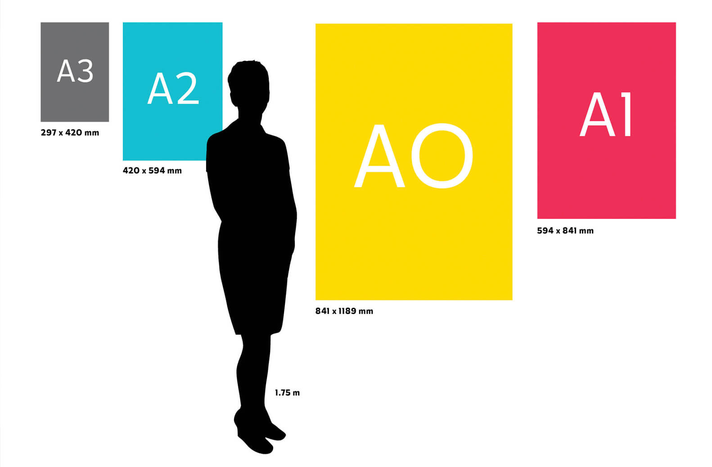

# LaTeX course : Beamer poster module
Module's sample files and figures:

## Complementary material in `figures/` : 

## References
1. Templates in [Overleaf](https://www.markdownguide.org/cheat-sheet/).
2. The Markdown [cheat sheet](https://www.overleaf.com/gallery/tagged/poster).
